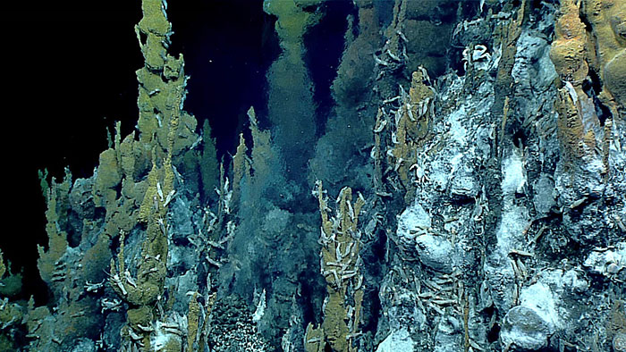
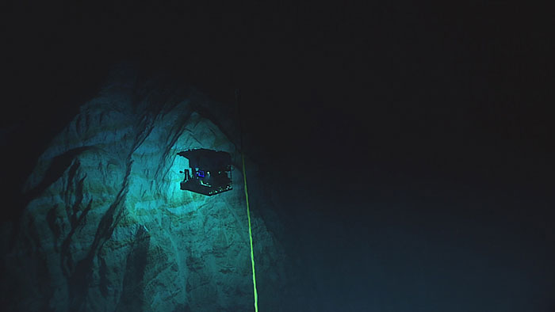
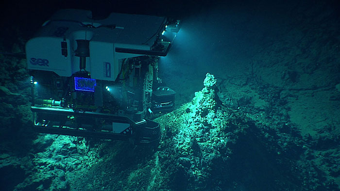
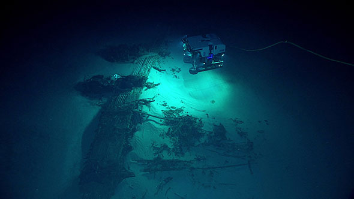

# [EX1605](http://oceanexplorer.noaa.gov/okeanos/explorations/ex1605/welcome.html):  Deepwater Exploration of the Marianas

_All images courtesy of NOAA Office of Ocean Exploration and Research, 2016 Deepwater Exploration of the Marianas_

## Leg 1, Dive 11: New Vent Field / 30m Chimney

May 1-2 UTC.   6:25 on bottom @ ~3000m

__Synopsis:__   Dive contains multiple large chimneys, one ~30m, and two at 14-15m, as well as a crater feature.

* [NOAA Mission Log](http://oceanexplorer.noaa.gov/okeanos/explorations/ex1605/logs/may11/welcome.html)
* [ROV Dive Report PDF](EX1605L1_DIVE11/EX1605l1_Dive11_Summary_20160501_FINAL.pdf)

## Leg 3, Dive 4: Hadal Ridge

June 20-21 UTC.  2:51 on bottom @ ~6000m.

__Synopsis:__   Deep dive in Marianas trench.  "document	the	diversity	of	organisms	at	this	transition	between	abyssal	and	hadal	zones."   Very interesting trench geology.

* [NOAA Mission Log](http://oceanexplorer.noaa.gov/okeanos/explorations/ex1605/logs/jul5/welcome.html)
* [ROV Dive Report PDF](EX1605L3_DIVE04/EX1605L3_DIVE04_20160621_ROVDiveSummary_Final.pdf)

## Leg 3, Dive 7: Chamorro Seamount

June 23-24 UTC.  7:04 on bottom at ~900m.

__Synopsis:__   Survey of Chamorro seamount, including a few small active hydrothermal vents.   Started upslope from outside of crater, then descend into crater.   

* [NOAA Mission Log](http://oceanexplorer.noaa.gov/okeanos/explorations/ex1605/logs/jun25/welcome.html)
* [ROV Dive Report PDF](EX1605L3_DIVE07/EX1605L3_DIVE07_20160624_ROVDiveSummary_Final.pdf)

## Leg 3, Dive 22: Romeo and Juliet

July 8-9 UTC.  6:10 on bottom.

__Synopsis:__  Investigate a series of sonar anomalies from EX1605L1 believed to be wreckage.  ROMEO and JULIET sites, approx 150m apart.   Landed near wing of B-29, upside down.   Nearby found forward wreckeage, and at another site found intact tail?

Might be suitable for wide-area reconstruction to establish broad-scale map of debris field.

* [NOAA Mission Log](http://oceanexplorer.noaa.gov/okeanos/explorations/ex1605/logs/jul9/welcome.html)
* [ROV Dive Report PDF (no UCH)](EX1605L3_DIVE22/EX1605L3_DIVE22_20160709_ROVDiveSummary_Final-NO_UCH.pdf)
